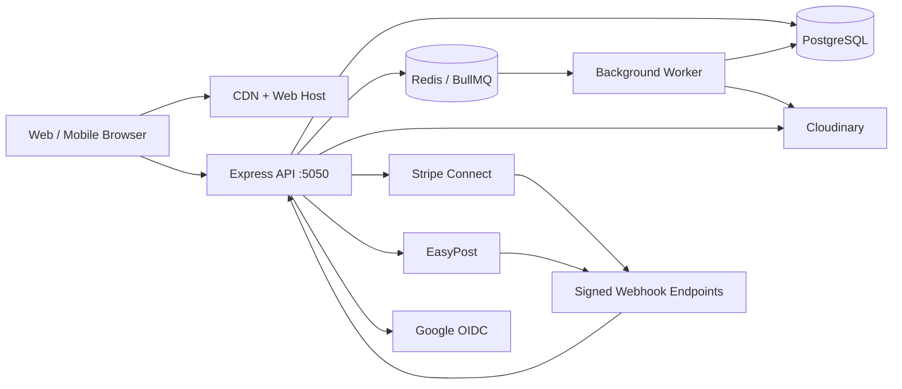

# System Architecture

## 1. Architecture style

SlabX should begin as a **TypeScript modular monolith** in a monorepo. One deployable API owns transactional business rules and one web application consumes it. Modules have explicit interfaces and database ownership conventions, making future extraction possible without paying an early microservice cost.

## 2. Repository layout

```text
slabx/
├── apps/
│   ├── web/                  # React + Vite
│   ├── api/                  # Express API on port 5050
│   └── worker/               # BullMQ jobs; added when first needed
├── packages/
│   ├── contracts/            # Zod schemas and shared API types
│   ├── database/             # Prisma schema, migrations, seed utilities
│   ├── config/               # Typed environment configuration
│   ├── observability/        # Logging, tracing, metrics
│   └── test-utils/           # Fixtures and integration helpers
├── docs/
├── .github/workflows/
├── package.json
└── pnpm-workspace.yaml
```

Use pnpm workspaces and Turborepo for task orchestration. Shared packages must not contain hidden network or database side effects.

## 3. Runtime components



Redis and a separate worker are introduced no earlier than the first durable asynchronous requirement (webhook follow-up, notification fan-out, image cleanup, expiry processing). Until then, PostgreSQL-backed outbox jobs may be processed by the API in a controlled single-process deployment.

## 4. Backend modules

| Module | Responsibilities |
| --- | --- |
| Identity | users, credentials, sessions, email verification, Google identities |
| Profiles | public profile, preferences, addresses, reputation summaries |
| Catalog | categories, sets, canonical cards, grading companies |
| Collection | physical items, ownership, item images, visibility |
| Listings | drafts, publication, price, search projection, reservation |
| Offers | offer/counter lifecycle, expiry, reservation trigger |
| Checkout | server totals, Stripe intent/session creation, idempotency |
| Orders | immutable purchase snapshot, order lifecycle, cancellation/refund coordination |
| Payments | payment attempts, webhook inbox, refunds, transfers, payouts |
| Shipping | rates, labels, shipments, tracking events, webhook handling |
| Reputation | reviews and aggregates |
| Watchlists | user-listing interest |
| Notifications | in-app/email events and delivery preferences |
| Trading | deferred proposals, revisions, locked items, cash components |
| Trust & Safety | reports, disputes, moderation actions, audit logs |

Modules call application services, not each other's route handlers. Cross-module invariants live in transaction-oriented use cases.

## 5. Frontend architecture

- Route-level feature folders aligned with backend modules
- TanStack Query for server state; no duplicated server cache in global stores
- React Hook Form plus shared Zod contracts for forms
- Small context/store only for local UI state and authenticated-user shell
- Generated or inferred TypeScript API contracts from shared schemas
- Responsive design tokens and accessible component primitives
- Direct-to-Cloudinary uploads use short-lived server-signed parameters
- Never place Stripe, Google, Cloudinary, or marketplace secrets in the bundle

## 6. Data consistency

### Single-item purchase

Within a serializable or explicit row-locking PostgreSQL transaction:

1. lock listing and collection-item rows (`SELECT ... FOR UPDATE` semantics);
2. verify seller ownership and listing `ACTIVE` state;
3. transition listing to `RESERVED` with buyer and expiry;
4. create pending order and price snapshot;
5. commit;
6. create/reuse Stripe operation using an idempotency key;
7. process outcome only from verified Stripe webhooks.

A partial unique index prevents more than one open order reservation for the same item. Expired reservations are released by an idempotent job.

### Outbox and webhook inbox

- The **webhook inbox** stores provider event ID and payload hash before processing. A unique provider/event ID makes replay a no-op.
- The **transactional outbox** stores domain events in the same transaction as state changes. Workers deliver notifications and provider follow-up with retries.
- Handlers are idempotent and compare current state before transition.

## 7. State machines

### Listing

| From | Allowed next states | Trigger |
| --- | --- | --- |
| `DRAFT` | `ACTIVE`, `CANCELLED` | seller publishes or discards |
| `ACTIVE` | `PAUSED`, `RESERVED`, `CANCELLED` | seller action or checkout/offer reservation |
| `PAUSED` | `ACTIVE`, `CANCELLED` | seller action |
| `RESERVED` | `ACTIVE`, `SOLD`, `CANCELLED` | expiry/failure, paid order, admin cancellation |
| `SOLD` | none | terminal commercial state |
| `CANCELLED` | none | terminal; relist creates a new listing |

Only the service layer transitions states. `RESERVED` includes reservation owner, reason, and expiry.

### Offer

Offers are an immutable revision chain rather than one overwritten record.

| From | Allowed next states |
| --- | --- |
| `PENDING` | `ACCEPTED`, `DECLINED`, `COUNTERED`, `CANCELLED`, `EXPIRED` |
| `COUNTERED` | terminal; a new linked revision becomes `PENDING` |
| `ACCEPTED` | `PAYMENT_PENDING`, `EXPIRED`, `CANCELLED_BY_SYSTEM` |
| `PAYMENT_PENDING` | `CONVERTED_TO_ORDER`, `PAYMENT_FAILED`, `EXPIRED` |

Only the current recipient may accept/decline/counter. Acceptance atomically reserves the listing.

### Order

| From | Allowed next states |
| --- | --- |
| `PENDING_PAYMENT` | `PAID`, `PAYMENT_FAILED`, `CANCELLED` |
| `PAID` | `AWAITING_SHIPMENT`, `REFUND_PENDING`, `DISPUTED` |
| `AWAITING_SHIPMENT` | `SHIPPED`, `CANCELLED`, `REFUND_PENDING`, `DISPUTED` |
| `SHIPPED` | `DELIVERED`, `DELIVERY_EXCEPTION`, `DISPUTED`, `RETURN_REQUESTED` |
| `DELIVERED` | `COMPLETED`, `DISPUTED`, `RETURN_REQUESTED` |
| `RETURN_REQUESTED` | `RETURN_IN_TRANSIT`, `RETURN_DECLINED`, `DISPUTED` |
| `RETURN_IN_TRANSIT` | `RETURNED`, `DISPUTED` |
| `RETURNED` | `REFUND_PENDING` |
| `REFUND_PENDING` | `REFUNDED`, `REFUND_FAILED` |
| `DELIVERY_EXCEPTION` | `SHIPPED`, `DISPUTED`, `REFUND_PENDING` |
| `COMPLETED`, `CANCELLED`, `REFUNDED` | terminal |

`DISPUTED` is an overlay recorded by a dispute entity; it does not erase the precise fulfillment/payment state.

### Shipment

`PENDING_LABEL → LABEL_PURCHASED → IN_TRANSIT → OUT_FOR_DELIVERY → DELIVERED`, with branches to `CANCELLED`, `FAILURE`, `RETURN_TO_SENDER`, and `DELIVERY_EXCEPTION`.

### Future trade

`DRAFT → PROPOSED → COUNTERED/ACCEPTED/DECLINED/CANCELLED/EXPIRED`. A counter creates a new immutable revision. Acceptance locks all offered items in one database transaction after rechecking ownership and availability. For cards-plus-cash, the trade remains `PAYMENT_PENDING` until verified payment; final ownership transfer is atomic and auditable.

## 8. External integrations

### Stripe Connect

Use Connect Express accounts to reduce marketplace compliance surface. Store Stripe IDs and status, never card data. The platform calculates application fees server-side. Webhook events—not redirect pages—advance payment states.

### EasyPost

The API creates address verifications, shipments, rates, and labels. Store provider IDs, selected service, label URL, tracking code, and normalized tracking events. Verify webhook signatures using the current EasyPost-supported mechanism and allowlist event types.

### Cloudinary recommendation

Cloudinary is recommended for MVP because it provides direct signed uploads, transformations, thumbnails, moderation hooks, metadata, and CDN delivery with less operational effort than S3. Abstract it behind `ImageStorage` so S3-compatible storage can replace it when volume or economics justify migration.

## 9. Deployment and observability

- Stateless web/API deployments; PostgreSQL and object storage hold durable state
- Structured JSON logs with request, user, order, provider-event, and trace correlation IDs
- Error tracking (Sentry), uptime checks, metrics, and alerting on webhook lag/failure
- Health endpoints distinguish liveness from database/provider readiness
- Daily encrypted backups with point-in-time recovery and restore drills
- Zero-downtime expand/migrate/contract database changes

## 10. Highest-risk areas

1. Payment, refund, transfer, and payout state reconciliation
2. Double-purchase and accepted-offer races
3. Account takeover and authorization/IDOR defects
4. Counterfeit, stolen, or misrepresented cards and certification claims
5. Webhook duplication, delay, reordering, and provider outages
6. Shipping loss, delivery disputes, and payout timing
7. User-generated image safety and storage abuse
8. Catalog duplication and data-quality degradation
9. Regulatory, tax, KYC, sanctions, and marketplace terms by geography
